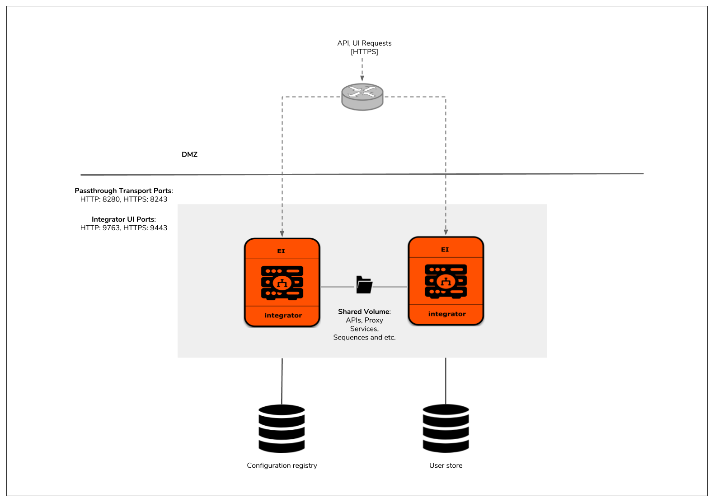

# BOSH release for WSO2 Enterprise Integrator deployment pattern 1

This directory contains the BOSH release implementation and PCF tile creation resources for WSO2 Enterprise Integrator 6.4.0.



The following sections provide general steps required for managing the WSO2 Enterprise Integrator 6.4.0 deployment pattern 1
BOSH release in a BOSH environment deployed in the desired IaaS.

For step-by-step guidelines to manage the BOSH release and build the PCF tile, refer the following:

## Contents

* [Prerequisites](#prerequisites)
* [Create the BOSH Release](#create-the-bosh-release)
* [Build the CF tile](#build-the-cf-tile)
* [Output](#output)
* [Delete Deployment](#delete-deployment)
* [BOSH Release Structure](#bosh-release-structure)
* [References](#references)

## Prerequisites

1. Install the following software.

    - [BOSH Command Line Interface (CLI) v2+](https://bosh.io/docs/cli-v2.html)
    - [Git client](https://git-scm.com/book/en/v2/Getting-Started-Installing-Git)
    - Software requirements specific to the IaaS

2. Obtain the following software distributions.

    - WSO2 Enterprise Integrator 6.4.0 product distribution
    - [Java Development Kit (JDK) 1.8](https://adoptopenjdk.net/archive.html)
    - Relevant Java Database Connectivity (JDBC) connectors
        - [mssql-jdbc-7.0.0.jre8.jar](https://www.microsoft.com/en-us/download/details.aspx?id=57175)
        - [mysql-connector-java-5.1.45-bin.jar](https://dev.mysql.com/downloads/connector/j/)


3. Clone this Git repository.

    ```
    git clone https://github.com/wso2/pivotal-cf-ei
    ```

   **Note**: In the remaining sections, the project root directory has been referred to as, **pivotal-cf-ei**.

## Create the BOSH release

In order to create the BOSH release for deployment pattern 1, you must follow the standard steps for creating a release with BOSH.

1. Move to root directory of the deployment pattern 1 BOSH release.

    ```
    cd pivotal-cf-ei/pattern-1/bosh-release/
    ```   
2. Copy the software obtained in step 2 of [Prerequisites](#prerequisites) to the `dist` folder.

3. Create the BOSH release and export it to a tarball.
    ```
    ./create.sh
    ```
## Build the CF tile

In order to build the CF tile for deployment pattern 1, follow the below steps.

1. Move the BOSH release tarball created in the above step to the root of tile directory and navigate into it.

    ```
    mv wso2ei-6.4.0-bosh-release.tgz ../tile/
    cd ../tile/
    ```   

2. Navigate to pivotal-cf-ei/pattern-1/tile directory and execute build.sh
    ```
    ./build.sh
    ```
    Executing this script will generate the tile for WSO2 EI 6.4.0 deployment. The tile will be created in the root of the ```product``` folder under tile directory.

4. Upload the tile to the Pivotal Environment and configure it.


## Output

To find the IP addresses of created instances via the BOSH CLI and access the WSO2 Enterprise Integrator management console via a web browser,

1. List all the deployments.

    ```
    bosh deployments
    ```

2. List all the instances within a deployment.

    ```
    bosh vms -d <name>
    ```
3. SSH into the vm as follows.

    ```
    bosh -d <name> ssh <instance>
    ```

4. Access the WSO2 Enterprise Integrator management console URL using the static IPs of the created instances.

    ```
    https://wso2ei.sys.<domain_name>/carbon
    ```

## Delete deployment

1. Delete the deployment.

    ```
    bosh -e <environment-alias> -d <name> delete-deployment
    ```

2. **[Optional]** Cleanup the BOSH release, stemcell, disks and etc.

    ```
    bosh -e <environment-alias> clean-up --all
    ```

## BOSH release structure

Structure of the directories and files of the BOSH release is as follows:

```
└── bosh-release
    ├── config
    ├── deployment
    ├── dist
    ├── images
    ├── jobs
    ├── packages
    ├── src
    └── create.sh
```

## References

* [BOSH CLI v2 commands](https://bosh.io/docs/cli-v2.html)
