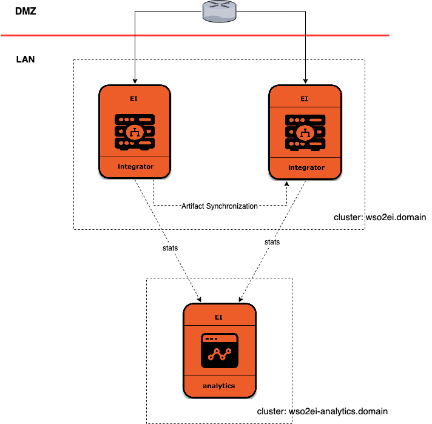

# Pivotal Cloud Foundry Resources for WSO2 Enterprise Integrator

This repository contains resources required to build and install WSO2 Enterprise Integrator in a Pivotal Cloud Foundry (PCF) environment. This document provides instructions you need to follow in order to deploy a WSO2 Enterprise Integrator setup on PCF.

## Prerequisites
Before starting the installation process, ensure that the following prerequisites are completed:
- A pre-configured Pivotal environment: For more information on the process for setting up the Pivotal environment on AWS, Azure, and GCP, see the documentation provided by Pivotal in [Architecture and Installation Overview](https://docs.pivotal.io/pivotalcf/2-4/installing/index.html).
- An SQL Database (MySQL or MS SQL): This database should contain the tables required to run Enterprise Integrator. The database schema required to populate the tables can be found within the <APIM_HOME>/dbscripts/ directory, where <APIM_HOME> refers to the [Enterprise Integrator Binary](https://wso2.com/api-management/).
- BOSH [CLI](https://bosh.io/docs/cli-v2/).
- PCF Tile Generator [CLI](https://docs.pivotal.io/tiledev/2-3/tile-generator.html).

## Setting up for BOSH Release
The first step in running Enterprise Integrator on PCF is creating a BOSH release. The following set of instructions should be followed in this process:
1. Clone the PCF Enterprise Integrator repository on GitHub by issuing the following command.
    ```bash
    git clone https://github.com/wso2/pivotal-cf-ei.git
    ```
    Enterprise Integrator contains five main components named Publisher, Store, Gateway, Traffic Manager, and Key Manager. In a stand-alone APIM setup, these components are deployed in a single server. However, in a typical production setup, they need to be deployed in separate servers for better performance. Installing and configuring each or selected component/s in different servers is known as a distributed setup.
    
    There are multiple ways in which these distributed setups can be arranged. These are known as **Deployment Patterns**. The PCF resources for Enterprise Integrator supports Pattern 2.
        
    The Deployment Architecture for Pattern 2 is as follows:
    
    
    
2. Add distributions required to run Pattern 2 as follows:
    1. Navigate to the `pattern-2` directory by issuing the following command.
        ```bash
        cd pivotal-cf-ei/pattern-2
        ls 
        ```
        Observe that there are two subdirectories named `bosh-release` and `tile` within this directory.
    2. Navigate into the `bosh-release` directory to view all of the resources required to deploy Enterprise Integrator Pattern 2 on PCF.
    3. To deploy Pattern 2, add the following files to the `dist` subdirectory inside the `bosh-deployment` directory.

        * [mssql-jdbc-7.0.0.jre8.jar](https://www.microsoft.com/en-us/download/details.aspx?id=57175)
        * [mysql-connector-java-5.1.45-bin.jar](https://dev.mysql.com/downloads/connector/j/)
        * [OpenJDK8U-jdk_x64_linux_hotspot_8u192b12.tar.gz](https://adoptopenjdk.net/archive.html)
        * [wso2ei-6.4.0.zip](https://wso2.com/integration/install/binary/)
        
        JDBC Drivers for MySQL and MS SQL are added into the `dist` directory to add flexibility to the deployment. The tile cannot be changed once created, as the tile is immutable. However, options to switch between different databases can be provided.
                
3. Create the BOSH release
    
    In order to create the BOSH release, the resource provides two scripts with the deployment. The scripts must be run in the following order:
    ```bash
    ./create.sh
    ```
    
    This may take up to 20 minutes. After the build is complete, a bosh-release is completed in the root of the `bosh-deployment` directory.  This release pack is named `wso2ei-6.4.0-bosh-release.tgz`.
    
## Building the Pivotal Tile for Enterprise Integrator
1. Add the [routing-release](https://github.com/cloudfoundry/routing-release/releases/tag/0.178.0) provided by PCF to the root of the `tile` directory. This delivers HTTP and TCP routing for Cloud Foundry.
2. Copy the bosh release from the `bosh-release` directory into the `tile` directory by issuing the following command.
    ```bash
    cd bosh-release
    mv wso2ei-6.4.0-bosh-release.tgz ../tile
    cd ../tile
    ```
3. Run the build script to build the tile by issuing the following command.
    ```bash
    ./build.sh
    ```
    The build process takes up to 5 minutes. After the build is complete, a tile named `wso2ei-tile-0.0.1.pivotal` is created in the root of the `/tile/product` directory.
    
## Install Enterprise Integrator in PCF
1. Log in to PCF Ops Manager and upload the tile built by clicking **Import a Product**.
2. After the tile is uploaded, add the tile to the PCF environment by clicking the + icon next to it.
3. After the tile is added to the environment, click on the **Enterprise Integrator** tile in the PCF environment to add configurations to the setup.
    
4. Set up the Enterprise Integrator tile.
    1. AZ and Network Assignments Page:
        
        * Place singleton jobs in: Select the AZ in which the Enterprise Integrator VM needs to run. The broker runs as a singleton job
        * Balance other jobs in: Select any combination of AZs.
        * Network: Select pcf-pas-network
        
        Click Save.
    2. Registry Database Connection Information:
        * **JDBC URL**:
            * **MySQL**: `jdbc:mysql://<hostname>:<port>/<db_name>?autoReconnect=true&amp;useSSL=false`
            * **MS SQL**: `jdbc:sqlserver://<hostname>:<port>;databaseName=<db_name>;`
        * **Driver Class Name**: Select the class name of the JDBC driver relevant to the database being used.
        * **Validation Query**: `SELECT 1`
        * **Username**: Username for database
        * **Password**: Password for database
        
        Click Save.
    3. User Management Database Connection Information:
        * **JDBC URL**:
            * **MySQL**: `jdbc:mysql://<hostname>:<port>/<db_name>?autoReconnect=true&amp;useSSL=false`
            * **MS SQL**: `jdbc:sqlserver://<hostname>:<port>;databaseName=<db_name>;`
        * **Driver Class Name**: Select the class name of the JDBC driver relevant to the database being used.
        * **Validation Query**: `SELECT 1`
        * **Username**: Username for database
        * **Password**: Password for database
            
            Click Save.
    4. Enterprise Integrator - Analytics Clustering Database connection information
        * **JDBC URL**:
            * **MySQL**: `jdbc:mysql://<hostname>:<port>/<db_name>?autoReconnect=true&useSSL=false`
            * **MS SQL**: `jdbc:sqlserver://<hostname>:<port>;databaseName=<db_name>;`
        * **Driver Class Name**: Select the class name of the JDBC driver relevant to the database being used.
        * **Validation Query**: `SELECT 1`
        * **Username**: Username for database
        * **Password**: Password for database
        
        Note that the JDBC URL for MySQL does not contain `&amp;`. Instead, it indicates the `&` symbol. This is due to the fact that the first two configurations save the configuration data in XML format, and `&amp;` is used as an escape character. However, this configuration stores its data in YAML and therefore, an escape character is not required.
        
        Click Save.
        
    5. Return to the **Installation Dashboard** in Ops Manager and click **Review Pending Changes**.
        
    6. Select the checkbox for Enterprise Integrator and click **Apply Changes**.
        
        
        The installation process may take around 25 minutes. After the installation is complete, the management console, and analytics portal can be accessed via the following URLs where domain_name refers to the **domain name** of the PCF environment.
        
        * ``https://wso2ei.sys.<domain_name>/carbon/``
        * ``https://wso2ei-dashboard.sys.<domain_name>/portal/``
